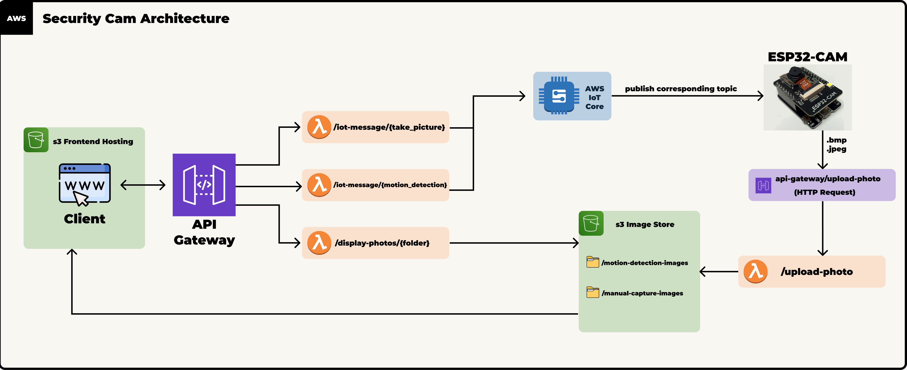

# Security Cam ESP32 Project

This repository contains all the components required to build a fully functional ESP32-based security camera system. The project integrates embedded systems, cloud infrastructure (AWS), and a web frontend to create a seamless and efficient surveillance solution. It demonstrates expertise in IoT development, cloud services, and basic Computer Networking knowledge.

## Architecture



## Overview

The Security Cam ESP32 project is designed to capture images using an ESP32-CAM module and securely upload them to AWS cloud infrastructure. The captured images can then be viewed and managed through a web interface. The project is divided into three primary sections:

1. **ESP32 (Firmware and Device Code)**: Contains the embedded C code for the ESP32-CAM module, responsible for capturing images and communicating with the cloud backend.
2. **Terraform Infrastructure**: Automates the provisioning of cloud resources needed for backend operations, including AWS IoT Core, Lambda, S3, and API Gateway.
3. **Web Frontend**: A static web application for viewing and managing the captured images stored in S3, as well as communicating with the ESP32 device.

## Features

- **IoT Device Integration**: Captures images from an ESP32-CAM and uploads them securely to AWS:
  - Applied embedded C utilizing the ESP-IDF to configure and build the program for the ESP32 device
  - Made use of the WiFi chip on the ESP32 to ensure stable connectivity for HTTP/S communications
  - Utilized the dual-core architecture to strategically divide up memory and compute restraints
    - Made use of Semaphores to ensure mutual exclusion of critical sections
  - Employed a motion detection algorithm, making use of efficient data structures
- **Cloud Infrastructure**: Fully automated backend infrastructure provisioned with Terraform, featuring:
  - IoT Core for device management and communication.
  - Lambda functions for serverless backend workflows.
  - S3 buckets for image storage and frontend hosting.
  - API Gateway for secure communication.
- **Web Interface**: A user-friendly frontend for viewing and managing images, designed for scalability and accessibility:
  - Since my frontend expertise is minimal, I used AI to create a simple HTML/Javascript/CSS setup

## Repository Structure

```
root/
├── esp32/                     # ESP32-CAM firmware and device code
├── terraform-infra/           # Terraform configuration for backend infrastructure
├── web-frontend/              # Web interface for managing and viewing captured images
└── README.md                  # High-level project description
```

### Folder Descriptions

- **`esp32/`**:

  - Includes the embedded firmware code for the ESP32-CAM module.
  - Handles image capture, Wi-Fi connectivity, and secure communication with the AWS backend.

- **`terraform-infra/`**:

  - Contains Terraform configuration and reusable modules for provisioning the cloud backend.
  - Automates the creation of AWS IoT Core, API Gateway, S3, and Lambda resources.

- **`web-frontend/`**:
  - A static web application hosted on S3 for viewing and managing images.
  - Built using HTML, CSS, and JavaScript, with a focus on usability and simplicity.

## Skills Demonstrated

- **Embedded Systems**: Developed firmware for the ESP32-CAM, integrating image capture and secure cloud communication.
- **Infrastructure as Code (IaC)**: Provisioned and managed AWS resources eniterly using Terraform, adhering to best practices.
- **IoT Development**: Configured AWS IoT Core to enable secure device communication via MQTT.
- **Serverless Computing**: Designed event-driven workflows using AWS Lambda (Python).
- **Web Development**: Built a responsive and intuitive static web frontend for user interaction.
- **Cloud Security**: Enforced least privilege policies with AWS IAM to secure resources.

## How It Works

1. **Image Capture**: The ESP32-CAM module captures an image and uploads it to the cloud using a pre-signed S3 URL.
2. **Backend Processing**: Lambda functions handle metadata storage and manage the backend workflows.
3. **Image Viewing**: The web frontend retrieves and displays the images from S3 for the user.

4. **Motion Detection**: There is also a motion detection feature that actively captures photos and compares them for differences. Uploads the corresponding photos to AWS. 

This repository serves as a portfolio project to illustrate my expertise in IoT, cloud computing, and application development. 
